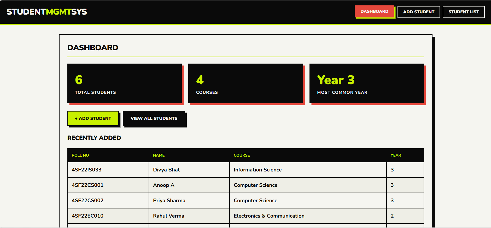

# Student Management System — MERN Stack

Week 2 Internship Project — Chand Web Technology Private Limited

A full-stack Student Management System built with **MongoDB, Express.js, React, and Node.js**.
Features a dashboard, add/edit/delete students, live search, REST API, and a fully
responsive brutalist-style UI (red / black / lime, sharp edges, bold typography).

---

## Folder Structure

```
student-mgmt-mern/
├── client/          # React frontend
│   ├── public/
│   └── src/
│       ├── components/
│       │   ├── Dashboard.js
│       │   ├── StudentForm.js
│       │   └── StudentList.js
│       ├── api.js
│       ├── App.js
│       ├── index.js
│       └── index.css
│   ├── package.json
│   └── .env.example
├── server/          # Express + MongoDB backend
│   ├── models/Student.js
│   ├── routes/students.js
│   ├── server.js
│   ├── package.json
│   └── .env.example
└── README.md
```
---
## Mock Ups
 
---

## Prerequisites

- Node.js v18+ and npm
- MongoDB running locally (`mongodb://127.0.0.1:27017`) **or** a MongoDB Atlas connection string

---

## Setup & Run (CMD Steps)

### 1. Open two terminals (one for server, one for client)

### 2. Backend Setup

```bash
cd student-mgmt-mern/server
copy .env.example .env        # Windows
# or: cp .env.example .env    # Mac/Linux

npm install
npm start
```

Server runs at: **http://localhost:5000**
Health check: `http://localhost:5000/api/health`

> Edit `.env` if you're using MongoDB Atlas — replace `MONGO_URI` with your Atlas connection string.

### 3. Frontend Setup (in a new terminal)

```bash
cd student-mgmt-mern/client
copy .env.example .env        # Windows
# or: cp .env.example .env    # Mac/Linux

npm install
npm start
```

App runs at: **http://localhost:3000**

---

## REST API Reference

| Method | Endpoint              | Description              |
|--------|-----------------------|--------------------------|
| GET    | /api/students         | Get all students (supports `?search=`) |
| GET    | /api/students/:id     | Get a single student     |
| POST   | /api/students         | Add a new student         |
| PUT    | /api/students/:id     | Update a student          |
| DELETE | /api/students/:id     | Delete a student          |
| GET    | /api/health           | API health check          |

### Sample Student JSON body (POST/PUT)

```json
{
  "name": "Anoop Kumar",
  "rollNo": "4SF22CS001",
  "email": "anoop@college.edu",
  "phone": "9876543210",
  "course": "Computer Science",
  "year": 3,
  "grade": "A",
  "address": "Mangaluru, Karnataka"
}
```

---

## Features

- Dashboard with live stats (total students, courses, year distribution)
- Add Student (validated form)
- Edit Student (inline pre-filled form)
- Delete Student (with confirm-tap safety)
- Student List with debounced live search (name / roll no / email / course)
- REST API built with Express + Mongoose
- MongoDB integration with unique roll number constraint
- Fully responsive UI (mobile → desktop)

---

## Tech Stack

- **Frontend:** React 18, Axios, plain CSS (brutalist design system)
- **Backend:** Node.js, Express.js
- **Database:** MongoDB + Mongoose

---

Built as part of the MERN Stack Development Internship — Week 2 task.
